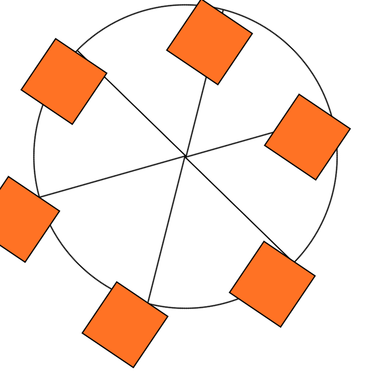

# Ferris Wheel Animation

A simple, animated Ferris Wheel built with HTML and CSS. This project visually demonstrates CSS animations, transforms, and creative layout techniques—no JavaScript required!

## 🌐 Live Demo
[View Demo](https://issamsensi.github.io/mobapps/WHEEL/)

## 📸 Screenshot


## ✨ Features
- Pure CSS animation for the wheel rotation and cabin color changes
- Responsive design (scales with viewport)
- Minimal, clean codebase

## 🛠️ Technologies Used
- HTML5
- CSS3 (animations, transforms, flexbox/positioning)

## 📦 Project Structure
```
WHEEL/
  index.html      # Main HTML file
  styles.css      # CSS for wheel and animation
  screens/
    wheel.png     # Screenshot of the animation
```

## 🚀 How to Use
1. **Clone the repository**
   ```zsh
   git clone https://github.com/issamsensi/mobapps.git
   cd mobapps/WHEEL
   ```
2. **Open `index.html` in your browser**
3. Enjoy the animated Ferris Wheel!

## 👤 Author
**ISSAM SENSI**

---
© 2025 [issamsensi](https://github.com/issamsensi)
